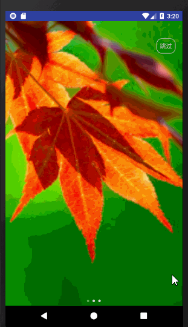

####HmBanner 的实现参考了以下参考链接
[BGABanner-Android ](https://github.com/bingoogolapple/BGABanner-Android)

[shucc](https://github.com/shucc/Carousel)

[Rolyyu](https://github.com/Rolyyu/banner)

[使用RecyclerView + ViewPager 的两个大坑！](http://blog.csdn.net/u011002668/article/details/72884893)

HmBanner 部分实现细节请参看[Android 无限轮播ViewPager的实现](https://blog.csdn.net/qq402164452/article/details/54866488)



使用
```
implementation 'com.hm.kof97:hmbanner:1.0'
```
1.首先实现ImageLoader重写展示图片的逻辑（使用的是glide 4.6.1）
```
public class GlideImageLoader extends ImageLoader {
    private RequestOptions options = new RequestOptions()
            .placeholder(R.drawable.img_bg)
            .error(R.drawable.img_bg);

    @Override
    public void displayImage(Context context, Object path, ImageView imageView) {
        Glide.with(context.getApplicationContext())
                .load(path)
                .apply(options)
                .into(imageView);
    }
}
```
2. xml布局文件
````xml
        <RelativeLayout
               android:id="@+id/activity_simple"
               android:layout_width="match_parent"
               android:layout_height="match_parent">
       
               <TextView
                   android:id="@+id/text_single"
                   android:layout_width="match_parent"
                   android:layout_height="wrap_content"
                   android:gravity="center"
                   android:text="一张图片"
                   android:textColor="#ff3344"
                   android:textSize="16sp" />
       
               <!--一张图片-->
               <com.hm.banner.HmBanner
                   android:id="@+id/simple_single_banner"
                   android:layout_width="match_parent"
                   android:layout_height="200dp"
                   android:layout_below="@+id/text_single"
                   app:num_indicator_bg="@drawable/shape_number_indicator_background" />
       
               <TextView
                   android:id="@+id/text_multi"
                   android:layout_width="match_parent"
                   android:layout_height="wrap_content"
                   android:layout_below="@+id/simple_single_banner"
                   android:layout_marginTop="8dp"
                   android:gravity="center"
                   android:text="多张图片"
                   android:textColor="#ff3344"
                   android:textSize="16sp" />
               
               <!--多张图片-->
               <com.hm.banner.HmBanner
                   android:id="@+id/simple_multi_banner"
                   android:layout_width="match_parent"
                   android:layout_height="200dp"
                   android:layout_below="@+id/text_multi" />
       
           </RelativeLayout>
            
````
3. 代码逻辑
````
 /**
     * 一张轮播图
     */
    private void initSingleBanner() {
        List<String> singleImgs = new ArrayList<>();
        singleImgs.add("http://img.zcool.cn/community/01b72057a7e0790000018c1bf4fce0.png");

        binding.simpleSingleBanner.setOnBannerClickListener(new OnBannerClickListener() {
            @Override
            public void OnBannerClick(int position) {
                Toast.makeText(SimpleActivity.this, "position=" + position, Toast.LENGTH_SHORT).show();
            }
        });
        binding.simpleSingleBanner.setImages(singleImgs)
                .setImageLoader(new GlideImageLoader())
                .setTransitionEffect(TransitionEffect.Flip)
                .isAutoPlay(false)
                .start();

    }
    

    /**
     * 多张轮播图
     */
    private void initMultiBanner() {
        List<String> multiTitles = new ArrayList<>();
        List<String> multiImgs = new ArrayList<>();
        multiTitles.add("当春乃发生");
        multiTitles.add("随风潜入夜");
        multiTitles.add("润物细无声");
        multiImgs.add(Images.imageThumbUrls[0]);
        multiImgs.add(Images.imageThumbUrls[1]);
        multiImgs.add(Images.imageThumbUrls[2]);
        binding.simpleMultiBanner.setOnBannerClickListener(new OnBannerClickListener() {
            @Override
            public void OnBannerClick(int position) {
                Toast.makeText(SimpleActivity.this, "position=" + position, Toast.LENGTH_SHORT).show();
            }
        });
        binding.simpleMultiBanner.setImages(multiImgs)
                .setImageLoader(new GlideImageLoader())
                .setTitles(multiTitles)
                .isAutoPlay(true)
                .start();
    }

````


* 关于Banner作为HeadView在RecyclerView中的使用请参看：https://github.com/humanheima/RecyclerViewDemo

####作为引导页的使用,HmBanner的  自动播放和循环播放属性都应该置为false

布局文件
```
<?xml version="1.0" encoding="utf-8"?>
<layout xmlns:app="http://schemas.android.com/apk/res-auto"
    xmlns:tools="http://schemas.android.com/tools">

    <FrameLayout xmlns:android="http://schemas.android.com/apk/res/android"
        android:layout_width="match_parent"
        android:layout_height="match_parent">

        <com.hm.banner.HmBanner
            android:id="@+id/simple_multi_banner"
            android:layout_width="match_parent"
            android:layout_height="match_parent"
            app:is_cycle="false" />

        <TextView
            android:id="@+id/text_jump_over"
            android:layout_width="wrap_content"
            android:layout_height="wrap_content"
            android:layout_gravity="right"
            android:layout_marginRight="16dp"
            android:layout_marginTop="40dp"
            android:background="@drawable/bg_jump_over"
            android:padding="8dp"
            android:text="@string/jump_over" />

        <TextView
            android:id="@+id/text_enter"
            android:layout_width="wrap_content"
            android:layout_height="wrap_content"
            android:layout_gravity="bottom|center_horizontal"
            android:layout_marginBottom="80dp"
            android:background="@drawable/bg_jump_over"
            android:padding="8dp"
            android:text="@string/enter"
            android:visibility="gone"
            tools:visibility="visible" />

    </FrameLayout>

</layout>

```

代码

```
public class GuidePageActivity extends AppCompatActivity {

    private ActivityGuidePageBinding binding;
    private List<String> multiImgs;

    public static void launch(Context context) {
        Intent intent = new Intent(context, GuidePageActivity.class);
        context.startActivity(intent);
    }

    @Override
    protected void onCreate(Bundle savedInstanceState) {
        super.onCreate(savedInstanceState);
        binding = DataBindingUtil.setContentView(this, R.layout.activity_guide_page);
        binding.textJumpOver.setOnClickListener(new View.OnClickListener() {
            @Override
            public void onClick(View v) {
                MainActivity.launch(GuidePageActivity.this);
                finish();
            }
        });
        binding.textEnter.setOnClickListener(new View.OnClickListener() {
            @Override
            public void onClick(View v) {
                MainActivity.launch(GuidePageActivity.this);
                finish();
            }
        });
        initBanner();
    }

    private void initBanner() {
        multiImgs = new ArrayList<>();
        multiImgs.add(Images.imageThumbUrls[0]);
        multiImgs.add(Images.imageThumbUrls[1]);
        multiImgs.add(Images.imageThumbUrls[2]);
        binding.simpleMultiBanner.setOnPageChangeListener(new ViewPager.SimpleOnPageChangeListener() {
            @Override
            public void onPageSelected(int position) {
                if (position == multiImgs.size() - 1) {
                    binding.textEnter.setVisibility(View.VISIBLE);
                    binding.textJumpOver.setVisibility(View.INVISIBLE);
                } else {
                    binding.textEnter.setVisibility(View.INVISIBLE);
                    binding.textJumpOver.setVisibility(View.VISIBLE);
                }
            }
        });

        binding.simpleMultiBanner.setImages(multiImgs)
                .setImageLoader(new GlideImageLoader())
                .start();
    }

}

```

####HmBanner相关属性
```xml
 <declare-styleable name="HmBanner">
        <!--自动轮播间隔时间-->
        <attr name="delay_time" format="integer" />
        <!--是否自动轮播-->
        <attr name="is_auto_play" format="boolean" />
        <!-- 是否循环播放 -->
        <attr name="is_cycle" format="boolean" />
        <!--是否是数字指示器-->
        <attr name="is_num_indicator" format="boolean" />

        <!--数字指示器文字颜色-->
        <attr name="num_indicator_text_color" format="color|reference" />
        <!--数字指示器文字的大小-->
        <attr name="num_indicator_text_size" format="dimension|reference" />
        <!-- 数字指示器背景 -->
        <attr name="num_indicator_bg" format="reference" />

        <!--圆点指示器的宽度-->
        <attr name="indicator_width" format="dimension" />
        <!--圆点指示器的高度-->
        <attr name="indicator_height" format="dimension" />
        <!--圆点指示器之间的间距-->
        <attr name="indicator_margin" format="dimension" />
        <!-- 圆点指示器容器背景 -->
        <attr name="point_container_background" format="reference|color" />
        <!-- 圆点指示器的切换drawable -->
        <attr name="point_drawable" format="reference" />
        <!-- 提示文案的文字颜色 -->
        <attr name="tip_text_color" format="reference|color" />
        <!-- 提示文案的文字大小 -->
        <attr name="tip_text_size" format="dimension|reference" />
        <!--轮播图缩放的方式-->
        <attr name="image_scale_type" format="enum">
            <enum name="fit_xy" value="0" />
            <enum name="center_crop" value="1" />
        </attr>
        <!-- 页面切换的动画效果 -->
        <attr name="transition_effect" format="enum">
            <enum name="defaultEffect" value="0" />
            <enum name="alpha" value="1" />
            <enum name="rotate" value="2" />
            <enum name="cube" value="3" />
            <enum name="flip" value="4" />
            <enum name="accordion" value="5" />
            <enum name="zoomFade" value="6" />
            <enum name="fade" value="7" />
            <enum name="zoomCenter" value="8" />
            <enum name="zoomStack" value="9" />
            <enum name="stack" value="10" />
            <enum name="depth" value="11" />
            <enum name="zoom" value="12" />
        </attr>
        <!-- 指示器的位置 -->
        <attr name="point_gravity">
            <flag name="top" value="0x30" />
            <flag name="bottom" value="0x50" />
            <flag name="left" value="0x03" />
            <flag name="right" value="0x05" />
            <flag name="center_horizontal" value="0x01" />
        </attr>

    </declare-styleable>
```

